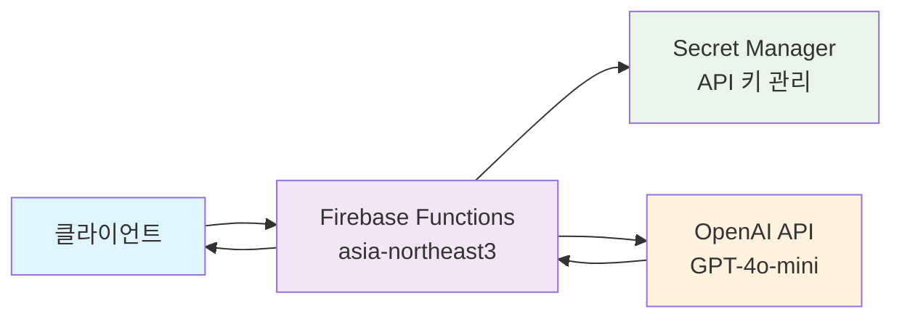

# 🌟 AI 번역 서비스 (Firebase Cloud Functions)

OpenAI GPT-4o-mini를 활용한 실시간 번역 서비스입니다. Firebase Cloud Functions 2nd gen을 기반으로 구축되어 안정적이고 확장 가능한 번역 API를 제공합니다.

## 🏗️ 아키텍처



**보안 특징:**
- 🔐 Secret Manager를 통한 안전한 API 키 관리
- 🛡️ Rate Limiting (분당 10회 요청 제한)
- 🔒 보안 헤더 (XSS, CSRF 방지)
- ✅ 입력 검증 (500자 제한, HTML 태그 제거)

## 🚀 주요 기능

- **실시간 번역**: OpenAI GPT-4o-mini를 활용한 고품질 번역
- **다국어 지원**: 10개 언어 지원 (한국어, 영어, 일본어, 중국어, 스페인어, 프랑스어, 독일어, 러시아어, 포르투갈어, 이탈리아어)
- **언어 감지**: 텍스트 언어 자동 감지 기능
- **보안 강화**: 입력 검증, 보안 헤더, Rate Limiting 적용
- **확장 가능**: Firebase Cloud Functions 2nd gen 기반 서버리스 아키텍처
- **현대적 보안**: Secret Manager를 통한 안전한 API 키 관리

## 📋 요구사항

- Node.js 22.x 이상
- Firebase CLI
- OpenAI API 키
- Firebase 프로젝트

## 🛠️ 설치 및 설정

### 1. 저장소 클론

```bash
git clone https://github.com/JunghyunRyu/javascript-firebase-translation-api.git
cd javascript-firebase-translation-api
```

### 2. 의존성 설치

```bash
cd functions
npm install
```

### 3. 환경변수 설정

```bash
# Windows PowerShell
Copy-Item env.example .env
```

`.env` 파일을 편집하여 OpenAI API 키를 설정하세요:

```env
OPENAI_API_KEY=your_openai_api_key_here
```

### 4. Firebase 프로젝트 설정

```bash
# Windows PowerShell
Copy-Item ../.firebaserc.example ../.firebaserc
```

`.firebaserc` 파일을 편집하여 Firebase 프로젝트 ID를 설정하세요.

### 5. 로컬 개발 서버 실행

```bash
npm run serve
```

## 📚 API 사용법

### 📖 API 문서
- **OpenAPI 스펙**: [docs/openapi.yaml](./docs/openapi.yaml)
- **Postman 컬렉션**: [docs/postman-collection.json](./docs/postman-collection.json)

### 번역 API

**엔드포인트**: `GET /translate`

**파라미터**:
- `message` (string, 필수): 번역할 텍스트 (최대 500자)
- `target` (string, 선택): 대상 언어 코드 (기본값: ko)
- `source` (string, 선택): 원본 언어 코드 (기본값: auto)

**지원 언어**:
- `ko`: 한국어
- `en`: 영어
- `ja`: 일본어
- `zh`: 중국어
- `es`: 스페인어
- `fr`: 프랑스어
- `de`: 독일어
- `ru`: 러시아어
- `pt`: 포르투갈어
- `it`: 이탈리아어

**응답 예시**:

```json
{
  "original_message": "Hello, world!",
  "source_language": "auto",
  "target_language": "ko",
  "translated_message": "안녕하세요, 세계!",
  "supported_languages": {
    "ko": "한국어",
    "en": "영어",
    "ja": "일본어"
  }
}
```

### 언어 감지 API

**엔드포인트**: `GET /detectLanguage`

**파라미터**:
- `message` (string, 필수): 언어를 감지할 텍스트 (최대 1000자)

**응답 예시**:

```json
{
  "original_message": "Hello, world!",
  "detected_language_code": "en",
  "detected_language_name": "영어",
  "confidence": "high",
  "supported_languages": {
    "ko": "한국어",
    "en": "영어",
    "ja": "일본어"
  }
}
```

**사용 예시**:

```bash
curl "https://asia-northeast3-your-project.cloudfunctions.net/translate?message=Hello%20world"
```

### 테스트 API

**엔드포인트**: `GET /helloWorld`

**응답**: `"Hello World!"`

**엔드포인트**: `GET /christmas`

**응답**: `{"message": "Merry Christmas!"}`

## 🔒 보안

이 프로젝트는 다음과 같은 보안 기능을 포함합니다:

- **입력 검증**: XSS 공격 방지, 길이 제한
- **보안 헤더**: XSS, 클릭재킹, MIME 스니핑 방지
- **에러 처리**: 민감한 정보 필터링
- **환경변수**: API 키 안전한 관리

자세한 보안 설정은 [SECURITY.md](./SECURITY.md)를 참조하세요.

## 🚀 배포

### Firebase Functions 배포

```bash
npm run deploy
```

### Secret Manager 설정 (Firebase Console)

1. Firebase Console → Functions → 설정
2. Secret Manager 섹션에서 `OPENAI_API_KEY` 시크릿 생성
3. 실제 OpenAI API 키 값 입력
4. 함수에서 시크릿 참조 설정

## 🧪 테스트

### 로컬 테스트

```bash
npm run shell
```

### 단위 테스트

```bash
npm test
```

### 테스트 커버리지

```bash
npm run test:coverage
```

### 코드 품질 검사

```bash
npm run lint
npm run lint:fix
```

## 📁 프로젝트 구조

```
├── functions/
│   ├── index.js              # Cloud Functions 메인 코드
│   ├── package.json          # Node.js 의존성
│   ├── env.example           # 환경변수 예시
│   ├── jest.config.js        # Jest 테스트 설정
│   ├── .eslintrc.js          # ESLint 설정
│   ├── __tests__/            # 테스트 파일들
│   │   └── translate.test.js # 번역 API 테스트
│   └── node_modules/         # 의존성 패키지
├── docs/
│   ├── openapi.yaml          # OpenAPI 스펙
│   ├── postman-collection.json # Postman 컬렉션
│   ├── api-reference.md      # API 참조 문서
│   ├── deployment-guide.md   # 배포 가이드
│   ├── troubleshooting.md    # 문제 해결 가이드
│   ├── faq.md               # 자주 묻는 질문
│   └── examples/            # 사용 예시
│       └── javascript.md    # JavaScript 예시
├── .github/
│   └── workflows/
│       └── ci.yml           # GitHub Actions CI/CD
├── firebase.json            # Firebase 설정
├── .firebaserc.example      # Firebase 프로젝트 설정 예시
├── .gitignore              # Git 제외 파일
├── SECURITY.md             # 보안 가이드
└── README.md               # 프로젝트 문서
```

## 🤝 기여하기

1. 이 저장소를 포크하세요
2. 기능 브랜치를 생성하세요 (`git checkout -b feature/amazing-feature`)
3. 변경사항을 커밋하세요 (`git commit -m 'Add amazing feature'`)
4. 브랜치에 푸시하세요 (`git push origin feature/amazing-feature`)
5. Pull Request를 생성하세요

## 📄 라이선스

이 프로젝트는 MIT 라이선스 하에 배포됩니다. 자세한 내용은 [LICENSE](./LICENSE) 파일을 참조하세요.

## 🆘 문제 해결

### 일반적인 문제들

1. **API 키 오류**: 환경변수가 올바르게 설정되었는지 확인
2. **배포 실패**: Firebase 프로젝트 ID가 올바른지 확인
3. **함수 실행 오류**: 로그를 확인하여 상세한 오류 메시지 확인

### 로그 확인

```bash
npm run logs
```

## 📞 지원

- **이슈 리포트**: [GitHub Issues](https://github.com/JunghyunRyu/javascript-firebase-translation-api/issues)
- **보안 문제**: [SECURITY.md](./SECURITY.md) 참조
- **문서**: [Wiki](../../wiki) 페이지 참조

## 🙏 감사의 말

- [OpenAI](https://openai.com/) - GPT-4 API 제공
- [Firebase](https://firebase.google.com/) - Cloud Functions 플랫폼
- [Node.js](https://nodejs.org/) - JavaScript 런타임

---

⭐ 이 프로젝트가 도움이 되었다면 스타를 눌러주세요!
